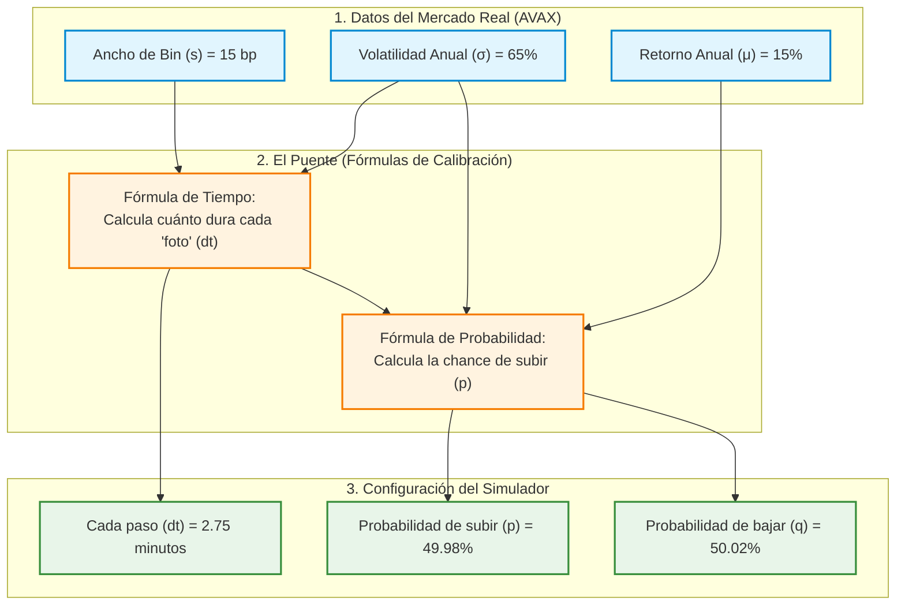

# Explicación Visual: ¿Qué es la Calibración de la Caminata Aleatoria?

Para entender esta matemática sin asustarse por las fórmulas, podemos usar una analogía muy simple: **un video continuo vs. una secuencia de fotos**.

---

## 1. La Analogía del Cine: Continuo vs. Discreto

El precio real de **AVAX** en el mercado cambia segundo a segundo, de forma fluida y continua (como una película de cine corriendo a 60 fotogramas por segundo). 

En cambio, nuestra **simulación en computadora** y la estructura de **bins de Trader Joe** son discretas. Para poder simularlo, debemos tomar "fotografías" a intervalos fijos de tiempo $\Delta t$. En cada foto, el precio solo puede haber subido un bin ($+1$) o bajado un bin ($-1$).

```text
PELÍCULA REAL (Continuo):
Precio:  100.00 ---> 100.01 ---> 100.03 ---> 100.02 ---> 100.05 ---> 100.08
Tiempo:  Seg 1       Seg 2       Seg 3       Seg 4       Seg 5       Seg 6

NUESTRAS FOTOS (Discreto, paso dt = 2 minutos):
Bin:     [Bin 100]  ===============================================> [Bin 101]
Tiempo:  Minuto 0                                                     Minuto 2
```

---

## 2. Diagrama de Flujo: El Proceso de Calibración

Este es el camino que siguen los datos. Tomamos datos reales de mercado, los pasamos por las dos fórmulas mágicas, y obtenemos los parámetros exactos para configurar el simulador de caminata aleatoria.



---

## 3. ¿Para qué sirve cada fórmula en cristiano?

### A. La Fórmula del Tiempo ($\Delta t$)
**¿Qué hace?** Determina la velocidad del reloj de nuestra simulación. 
*   Si AVAX es extremadamente volátil (se mueve como loco), la simulación debe tomar fotos muy seguido (un $\Delta t$ pequeño, de pocos segundos) para no perderse ningún salto de bin.
*   Si AVAX está plano y casi no se mueve, la simulación puede tomar fotos muy espaciadas (un $\Delta t$ grande, de horas o días), porque el precio tardará mucho tiempo en saltar de un bin a otro.

---

### B. La Fórmula de la Probabilidad ($p$)
**¿Qué hace?** Determina la inclinación o tendencia del precio.
*   Si el mercado es **alcista** (el drift $\mu$ es positivo y fuerte), la fórmula te dará una probabilidad $p > 0.50$ (por ejemplo, $52\%$). Esto significa que en cada paso es ligeramente más probable que el precio suba a que baje, haciendo que al final de muchos pasos la caminata termine arriba.
*   Si el mercado es **bajista**, la probabilidad $p$ será menor a $0.50$ (por ejemplo, $48\%$).
*   Si el mercado es **justo y neutral** (sin tendencia), la probabilidad es exactamente $p = 0.50$ ($50\%$), simulando un cara o cruz perfecto.

---

## 4. Un Ejemplo Numérico Real (El caso AVAX que corrimos)

Para que lo veas con números tangibles, este fue el resultado exacto de la corrida de nuestro programa:

| Variable de Entrada (Mercado) | Valor | Significado |
| :--- | :--- | :--- |
| **Volatilidad ($\sigma$)** | $65\%$ | AVAX fluctúa bastante a lo largo del año. |
| **Retorno Anual ($\mu$)** | $15\%$ | Tendencia alcista anual esperada. |
| **Ancho del Bin ($s$)** | $0.15\%$ | Cada contenedor de Trader Joe mide 15 puntos básicos. |

### El Puente de Calibración calcula:

1.  **Intervalo por paso ($\Delta t$) = $0.00000532$ años (aprox. $2.75$ minutos).**
    *   *Significado:* Para modelar correctamente a AVAX, cada paso de nuestra simulación debe durar exactamente **2 minutos y 45 segundos**.
2.  **Probabilidad de subir ($p$) = $49.9891\%$.**
    *   *Significado:* En cada intervalo de 2.75 minutos, la probabilidad de que AVAX salte al bin de arriba es de $49.989\%$, y de que baje es de $50.011\%$. (Casi simétrico, porque en una ventana tan corta como 2 minutos, la tendencia anual del 15% apenas es visible frente al ruido de la volatilidad del 65%).
