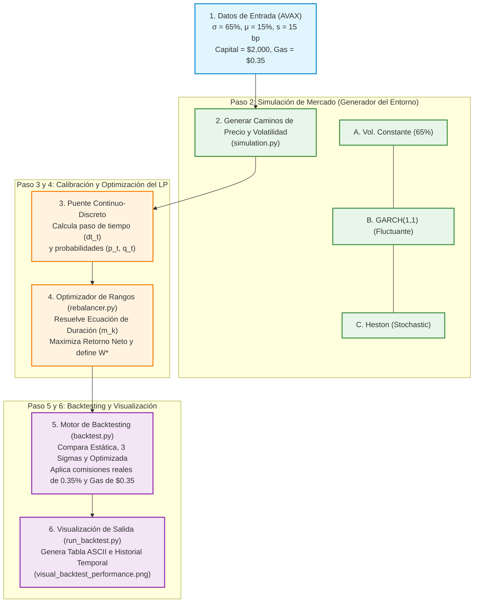

# Arquitectura y Pipeline Cuantitativo Secuencial del Gestor de Liquidez Activa

Este documento proporciona una explicación completa, detallada y estrictamente secuencial de la matemática, la lógica y el software implementados para el **Proyecto 01: Gestor de Liquidez Activa en Trader Joe (Avalanche C-Chain)**.

---

## 1. Aclaración Conceptual: ¿Qué hace GARCH/Heston frente al Optimizador?

Antes de desglosar el pipeline, resolvamos tu excelente duda sobre la calibración y el ancho:

> **El error común:** Creer que la simulación de GARCH o Heston calcula por sí misma el ancho óptimo de la liquidez.
>
> **La realidad física:** 
> * **GARCH y Heston** actúan como **el generador del clima (el entorno)**. Ellos simulan cómo se mueven el precio y la volatilidad del activo real bloque a bloque. No toman decisiones; solo describen la aleatoriedad y la incertidumbre del mercado.
> * **El Optimizador (`rebalancer.py`)** actúa como **el cerebro del LP**. Es el que calcula qué ancho de rango $W^*$ maximiza las comisiones netas para una volatilidad específica.
> * **La conexión:** Cuando el precio sale de rango, el bot dinámico "abre la ventana", lee la volatilidad instantánea actual $\sigma_t$ generada por GARCH o Heston (ej. $95\%$), y le pregunta al optimizador: *"¿Cuál es el mejor ancho de bins para operar con una volatilidad del 95%?"*. El optimizador calcula $W^*_t$ usando las fórmulas de Hitting Time, y el bot establece la nueva posición con ese ancho exacto.

---

## 2. El Pipeline Secuencial del Sistema (Paso a Paso)

A continuación se detalla secuencialmente el flujo completo de la información y el cómputo, desde que tomamos los datos de Avalanche hasta que graficamos el rendimiento neto de la estrategia.

---

### Paso 1: Configuración de Parámetros de Entrada (Mercado Real)
Tomamos variables físicas reales correspondientes al pool de AVAX/USDC de Trader Joe en Avalanche C-Chain:
1.  **Volatilidad del activo ($\sigma$):** $65\%$ anualizada.
2.  **Retorno del activo ($\mu$):** $15\%$ anual esperado (drift).
3.  **Paso del bin ($s$):** $15$ puntos básicos ($s = 0.0015$).
4.  **Capital provisto por el LP:** $\$2,000$ USD.
5.  **Costo de transacción de gas real en C-Chain:** $\$0.35$ USD.
6.  **Comisión swap del pool (Swap Fee):** $0.35\%$ del volumen (`base_fee_rate = 0.0035`).

---

### Paso 2: Simulación de Mercado (Generación del Clima)
En `simulation.py`, simulamos **5,000 caminos independientes** de $300$ pasos de tiempo discretos. El simulador genera la trayectoria de los precios ($X_t$, medido en bins) y de las volatilidades ($\sigma_t$) usando uno de los tres modelos disponibles:

*   **Modelo A (Volatilidad Constante):** La volatilidad $\sigma_t$ es constante en $65\%$.
*   **Modelo B (GARCH 1,1 - Volatilidad Autoregresiva):**
    A partir de la volatilidad anterior $\sigma_{t-1}$ y un choque de precio normal $Z_t$, actualiza la varianza del bloque:
    $$ \sigma_t^2 = \omega + \alpha \cdot (\sigma_{t-1}^2 \cdot Z_t^2) + \beta \cdot \sigma_{t-1}^2 $$
*   **Modelo C (Heston - Volatilidad Estocástica):**
    La volatilidad es su propia caminata aleatoria independiente con reversión a la media:
    $$ \sigma_t^2 = \sigma_{t-1}^2 + \theta(\sigma_{unconditional}^2 - \sigma_{t-1}^2)\Delta t_{t-1} + \eta \sigma_{t-1}\sqrt{\Delta t_{t-1}} Z_t $$

---

### Paso 3: Calibración Continuo-Discreta (El Puente)
Para garantizar que la simulación por computadora tenga la misma tendencia e incertidumbre que el mercado de AVAX continuo, calibramos los parámetros discretos de la caminata aleatoria en cada paso de tiempo. 

Dado que la rejilla de bins de Trader Joe es rígida (saltos de tamaño $s$), implementamos un **Reloj de Tiempo Variable (Time-Changed Random Walk)**. En cada paso:
1.  **Intervalo de tiempo ($\Delta t_t$ en años):** Es inversamente proporcional a la varianza. Si la volatilidad del bloque $\sigma_t$ es alta, el tiempo vuela y el paso representa pocos minutos; si es baja, el paso dura horas.
    $$ \Delta t_t = \left( \frac{\ln(1 + s)}{\sigma_t} \right)^2 $$
2.  **Probabilidad de subir de bin ($p_t$):** Se ajusta para reflejar el drift real anual $\mu$:
    $$ p_t = \frac{1}{2} \left( 1 + \frac{\mu - \frac{1}{2}\sigma_t^2}{\sigma_t} \sqrt{\Delta t_t} \right) $$
3.  **Probabilidad de bajar de bin ($q_t$):** $q_t = 1 - p_t$.

---

### Paso 4: El Optimizador Económico del Cerebro (rebalancer.py)
Para encontrar el ancho de rango óptimo $W^*$, resolvemos analíticamente las **ecuaciones teóricas en diferencias** de Hitting Time (duración esperada de la liquidez).

Para un ancho de rango $W$ dado, asumiendo que colocamos la liquidez centrada ($L = 0, U = W, k = W // 2$):
1.  **Duración Esperada ($m_k$ en pasos discretos antes de salir del rango):**
    $$ m_k = \frac{k - L}{q_t - p_t} - \frac{U - L}{q_t - p_t} \cdot \left( \frac{1 - (q_t/p_t)^{k-L}}{1 - (q_t/p_t)^{U-L}} \right) $$
2.  **Distribución de Capital por Bin:**
    $$ C_{bin} = \frac{\text{Capital Total}}{W} $$
3.  **Swap Fee ganado por paso activo:**
    $$ F_{step} = C_{bin} \cdot \text{base\_fee\_rate} $$
4.  **Tasa de Retorno Neto por paso ($R_{net}$):** Pondera la ganancia bruta esperada antes de salir frente al costo erosivo de pagar el gas fee de Avalanche:
    $$ R_{net}(W) = F_{step} - \frac{\text{Gas\_Fee}}{m_k(W)} $$

**La Optimización:** El optimizador evalúa esta función para todos los anchos posibles $W \in [2, 60]$ y selecciona el ancho óptimo **$W^*$** que maximiza $R_{net}$. 

*   *El resultado numérico real:* Con capital de $\$2,000$ USD, comisiones de **0.35%** y gas de **$0.35 USD**, el optimizador determina que el ancho óptimo es de **$W^* = 2$ bins**, cobrando un fee bruto masivo de **$3.50 USD por paso** (el cual aniquila los $0.35 USD de costo de gas en cada salida).

---

### Paso 5: El Simulador de Backtesting Competitivo (backtest.py)
Una vez simulados los mercados y calibrados los optimizadores, el motor de backtesting evalúa las **6 estrategias cuantitativas** en paralelo a lo largo de cada uno de los 5,000 caminos independientes:

1.  **Estrategia Manual Estática:** Mantiene un rango fijo de 12 bins. Rebalancea solo cuando el precio escapa, centrando el rango pero manteniendo el ancho constante.
2.  **Estrategia Dinámica 1-Sigma:** Ajusta su ancho dinámicamente como $1\sigma_{bins, t}$ en función de la volatilidad del bloque.
3.  **Estrategia Dinámica 2-Sigma:** Ajusta su ancho como $2\sigma_{bins, t}$ en cada rebalanceo.
4.  **Estrategia Dinámica 3-Sigma:** Ajusta su ancho como $3\sigma_{bins, t}$.
5.  **Estrategia Dinámica Optimizada:** Consulta el ancho teórico óptimo $W^*_t$ calculado por el cerebro de primer paso en función de la volatilidad actual.
6.  **Estrategia Dinámica con Cortafuegos (Circuit Breaker):** Monitorea la volatilidad. Si supera el **120%**, retira de inmediato el 100% de la liquidez a stablecoins para evitar costos de transacción inútiles en pánicos, y re-deposita cuando la volatilidad se enfría.

---

### Paso 6: Visualización de Salida y Métricas (run_backtest.py)
El script consolida los resultados agregados calculando la ganancia neta promedio en dólares, la desviación estándar del retorno (variabilidad) y el Sharpe Ratio.

Finalmente, genera el gráfico intuitivo de **Tiempo vs. Rentabilidad Acumulada (USD)** para una trayectoria de precios real (Camino 0):
*   El eje horizontal (X) muestra el tiempo transcurrido en días reales.
*   El eje vertical (Y) muestra la rentabilidad acumulada en dólares netos.
*   Permite contrastar de manera directa y visual cómo la estrategia optimizada (verde) acumula comisiones a paso veloz frente a las de sigmas (diluidas) y cómo sufre y absorbe los "hachazos" de gas de $0.35 USD.

---

## 3. Glosario Secuencial de Fórmulas Matemáticas

| Paso | Concepto Financiero / Estocástico | Ecuación Matemática |
| :--- | :--- | :--- |
| **Paso 1** | Mapeo discreto de precios a bins | $$S(i) = S_0 \cdot (1 + s)^i$$ |
| **Paso 3** | Intervalo de tiempo por paso (reloj variable) | $$\Delta t_t = \left( \frac{\ln(1 + s)}{\sigma_t} \right)^2$$ |
| **Paso 3** | Probabilidad local de salto alcista ($p$) | $$p_t = \frac{1}{2} \left( 1 + \frac{\mu - \frac{1}{2}\sigma_t^2}{\sigma_t} \sqrt{\Delta t_t} \right)$$ |
| **Paso 4** | Duración esperada discreta hasta absorción ($m_k$) | $$m_k = \frac{k - L}{q - p} - \frac{U - L}{q - p} \cdot \left( \frac{1 - (q/p)^{k-L}}{1 - (q/p)^{U-L}} \right)$$ |
| **Paso 4** | Tasa de retorno neta por paso (Optimizador) | $$R_{net}(W) = \frac{\text{Capital} \cdot \text{swap\_fee}}{W} - \frac{\text{Gas\_Fee}}{m_k(W)}$$ |
| **Paso 5** | Desviación estándar del precio en bins (Sigmas) | $$\sigma_{bins, t} = \frac{\sigma_t \sqrt{\tau}}{\ln(1+s)}$$ |
| **Paso 5** | Ancho dinámico basado en sigmas | $$W_t = 2 \cdot \max(1, \, \text{round}(k \cdot \sigma_{bins, t}))$$ |
| **Paso 6** | Retorno Ajustado por Riesgo (Sharpe Ratio) | $$\text{Sharpe} = \frac{\text{Promedio}(\text{Retorno Neto})}{\text{Desviación Estándar}(\text{Retorno Neto})}$$ |
